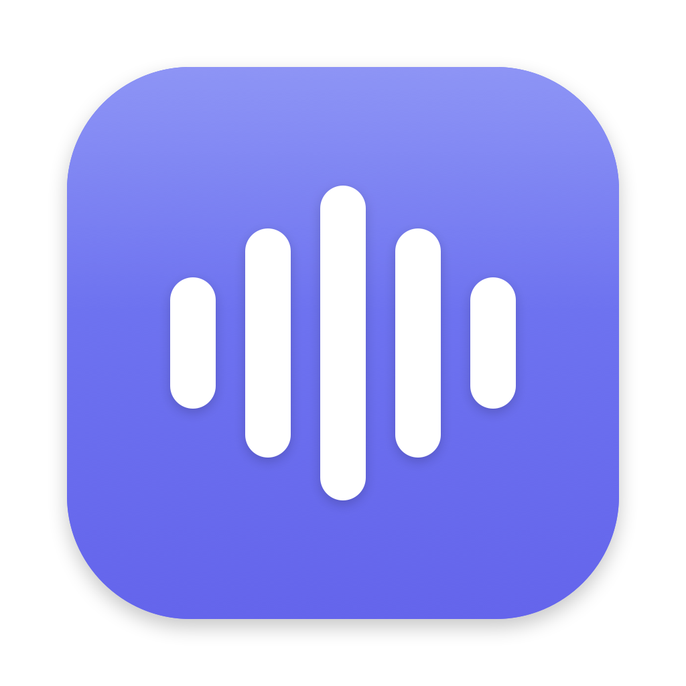

# Aloud

A macOS menu-bar app that reads text out loud, locally.

Select text in any app → **Services** → **Speak with Aloud**. Or speak the
clipboard from the menu bar. Nothing is sent anywhere: both engines synthesize
on your own machine, there is no API key and no cost.



## Two engines

| | **Apple** (default) | **Kokoro** |
|---|---|---|
| Quality | Compact voices are dated; Premium/Enhanced are good | Better |
| Resident memory | none | ~1.26 GB warm, ~24 MB idle |
| First audio | ~1s | ~6s cold, ~0.7s warm |
| Setup | none — built into macOS | one script, ~330 MB model |

**Apple** drives macOS's own speech synthesis through `say`. It costs nothing at
rest: `say` is a short-lived child process and the work happens in an OS-owned
XPC service.

> macOS ships only the *compact* voices, which sound dated. The good ones —
> Premium and Enhanced — are a free manual download under **System Settings →
> Accessibility → Spoken Content → System Voice → Manage Voices**. The Voice
> menu has a **Get More Voices…** shortcut. Judge Apple's quality only after
> grabbing one.

**Kokoro** runs [Kokoro-82M](https://huggingface.co/hexgrad/Kokoro-82M) on Apple
Silicon (MPS). Better voices, at the cost of a resident model — worth it for
long listening, overkill for a paragraph.

Each engine remembers its own voice, because `af_heart` and `Isha (Premium)`
have nothing in common and switching engine shouldn't silently switch voice.

### Kokoro languages

Kokoro ships **54 voices across 9 languages**, all inside the one model file —
nothing extra to download. The voice name *is* the language: `bf_emma` is
British, so picking a voice selects the language and there is nothing separate
to set.

| | Voices | |
|---|---|---|
| American English | 20 | works out of the box |
| British English | 8 | works out of the box |
| Hindi | 4 | works out of the box |
| Spanish · Portuguese | 3 · 3 | works out of the box |
| Italian · French | 2 · 1 | works out of the box |
| Japanese | 5 | needs `misaki[ja]` |
| Mandarin Chinese | 8 | needs `misaki[zh]` |

`aloud voices` lists them grouped by language, and the menu bar nests them the
same way. Switching language restarts the synth worker (~6s), because Kokoro
fixes a pipeline's language when it is constructed.

Japanese and Chinese need a package that isn't installed by default — they pull
in a lot for two languages most users won't touch. Rather than mispronouncing,
Aloud refuses the voice and names what's missing:

```bash
~/.aloud/.venv/bin/python -m pip install 'misaki[ja]'   # or misaki[zh]
```

## Install

```bash
git clone https://github.com/fabianaitech/Aloud.git
cd Aloud && ./install.sh
```

That's it — engine, Services and the menu-bar app. Apple's voices work
immediately; there's nothing to download. Add `--no-app` to skip the app if you
only want the Services and the CLI.

Requires macOS 13+. The app builds with the Swift toolchain from Xcode or the
Command Line Tools and has no third-party dependencies.

**Why build instead of downloading a `.dmg`?** The app is ad-hoc signed, not
notarized. macOS attaches a quarantine flag to *downloaded* files, so a `.dmg`
would greet you with "Apple could not verify this app is free of malware". A
locally built copy has no such flag and simply runs. One command either way.

Optionally, for better voices:

```bash
aloud setup           # Kokoro engine (~330 MB model, needs uv)
```

…and Apple's own good voices (Premium/Enhanced) are a free download under
System Settings → Accessibility → Spoken Content → System Voice → Manage Voices.

Give **Speak with Aloud** a keyboard shortcut under System Settings → Keyboard →
Keyboard Shortcuts → Services. That is what turns it from a menu dive into a
reflex.

## How it works

```
Services menu ──┐  any selected text
menu-bar app ───┼─▶ control.sh ─▶ server.py  ──▶ afplay
CLI (aloud) ────┘                 ~24 MB, always up
                                  queue + pause/stop/skip
                                       │
                          ┌────────────┴────────────┐
                          ▼                         ▼
                     `say` (Apple)            synth.py (Kokoro)
                     nothing resident         ~1.26 GB, on demand,
                                              killed after 10 min idle
```

`server.py` is the supervisor: the HTTP API on `127.0.0.1`, the playback queue,
and pause/stop/skip. It is **stdlib-only and ~24 MB**, deliberately — importing
torch here would put ~800 MB into a process that spends nearly all its life
waiting. Kokoro's weight lives in `synth.py`, a subprocess started on demand and
killed after ten idle minutes, so an idle engine is nearly free while still
being a *running* engine: it answers, and the next request transparently wakes
the worker.

Everything — the app, the Services, the CLI — goes through `control.sh`, so
there is one control surface and the settings files can't drift from the daemon.

## The menu-bar icon

The same five-bar waveform as the app icon, drawn as a monochrome template image
so macOS recolours it for light, dark and tinted menu bars. The state is carried
by the bars rather than by swapping to unrelated symbols:

| Bars | Meaning |
|------|---------|
| Flattened and dimmed | Engine not running |
| The static waveform | Idle |
| Animating as a level meter | Speaking |
| Two tall bars | Paused — reads as ⏸, same shapes |
| A spinner | Starting the engine, or waking the Kokoro worker |

The animation runs only while audio is actually playing.

## CLI

`install.sh` links an `aloud` command onto your PATH.

```bash
aloud "the build is green"     # speak some text
git log -1 --format=%s | aloud # speak stdin
aloud clipboard                # speak the clipboard

aloud status                   # what the engine is doing
aloud engine apple             # or: kokoro
aloud voice "Zoe (Enhanced)"   # Apple
aloud voice bf_emma            # Kokoro — British; switches language too
aloud voices                   # grouped by language (Kokoro) or tier (Apple)
aloud 1.25                     # speed
aloud pause | resume | stop | skip
aloud start | restart | stop-engine
aloud setup                    # install the optional Kokoro engine
```

Anything that isn't a known subcommand is treated as text to speak, so
`aloud "check the deploy"` does the obvious thing. Use `aloud say <text>` if the
text might collide with a subcommand name.

## Configuration

Environment variables, read when the daemon starts:

| Var | Default | Meaning |
|-----|---------|---------|
| `ALOUD_PORT` | `8877` | Daemon port (loopback only) |
| `ALOUD_ENGINE` | `apple` | Engine at first run; after that `speak.engine` wins |
| `ALOUD_SPEED` | `1.0` | Default speed (0.5–2.0) |
| `ALOUD_IDLE_TIMEOUT` | `600` | Seconds before the Kokoro worker is killed. `0` keeps it resident |
| `KOKORO_VOICE` | `af_heart` | Kokoro's boot voice (engine-specific, hence the prefix) |

Kokoro's language is **not** configured — it is read off the voice name, and the
worker restarts when it changes. `KOKORO_LANG` is set per worker by the daemon.

Settings live in `~/.aloud/` as one-line files (`speak.engine`, `speak.speed`,
`speak.voice.apple`, `speak.voice.kokoro`, `speak.enabled`) so the shell, the
app and the daemon all read the same source of truth.

## Claude Code integration (optional)

Aloud started as a way to have [Claude Code](https://claude.com/claude-code)
read its replies aloud. That integration is preserved in
[`integrations/claude-code/`](integrations/claude-code/) — a Stop hook, a
barge-in hook and a `/speak` command — but it is entirely optional and the app
knows nothing about it.

## Uninstall

```bash
aloud stop-engine
launchctl bootout "gui/$(id -u)/com.fabianaitech.aloud.engine" 2>/dev/null   # if installed
rm -rf ~/.aloud /Applications/Aloud.app
rm -f  "$(command -v aloud)"
rm -rf ~/Library/Services/"Speak with Aloud.workflow" \
       ~/Library/Services/"Stop speaking (Aloud).workflow"
/System/Library/CoreServices/pbs -flush
```

## Licence

MIT — see [LICENSE](LICENSE).

Kokoro-82M is Apache-2.0, downloaded from Hugging Face at setup time and not
redistributed here. Apple's voices are part of macOS.
